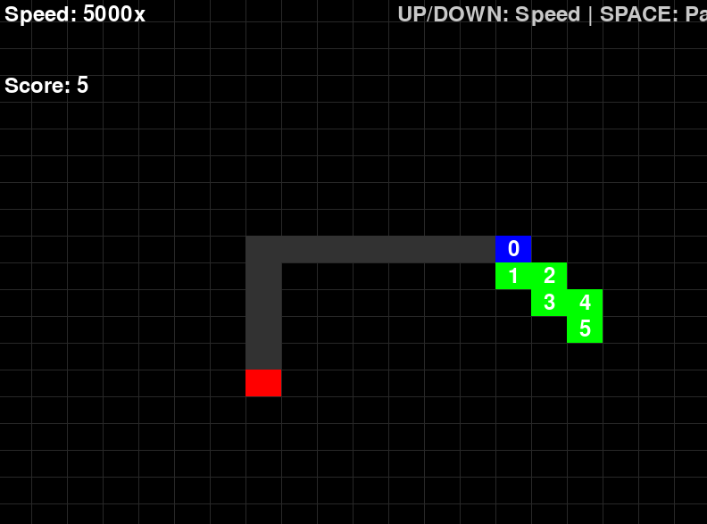

# Snake AI Training Project



## Overview
This project implements a reinforcement learning approach to train an AI agent to play the classic Snake game using Deep Q-Learning (DQN).

## Features
- Manual gameplay mode
- AI training with Deep Q-Network
- Dynamic speed control
- Automatic model weight saving and loading
- Pygame-based visualization

## Requirements
- Python 3.8+
- Libraries:
  - pygame
  - torch
  - numpy

## Project Structure
- `normalGame.py`: Manual gameplay mode
- `train.py`: AI training script
- `Src/snake_trainer.py`: Main training logic
- `Src/snake_enviroment.py`: Game environment
- `Src/model/_3.py`: DQN model definition

## Training Process
- Uses epsilon-greedy exploration strategy
- Implements experience replay
- Periodically updates target network
- Saves model weights every 100 episodes

## How to Run
### Manual Gameplay
```bash
python normalGame.py
```

### Train AI
```bash
python train.py
```

## Training Controls
- Up/Down Arrow: Adjust training speed
- Spacebar: Pause/Resume training

## Model Saving
- Weights automatically saved in `model_weights/`
- Latest weights loaded at training start

## License
MIT License
